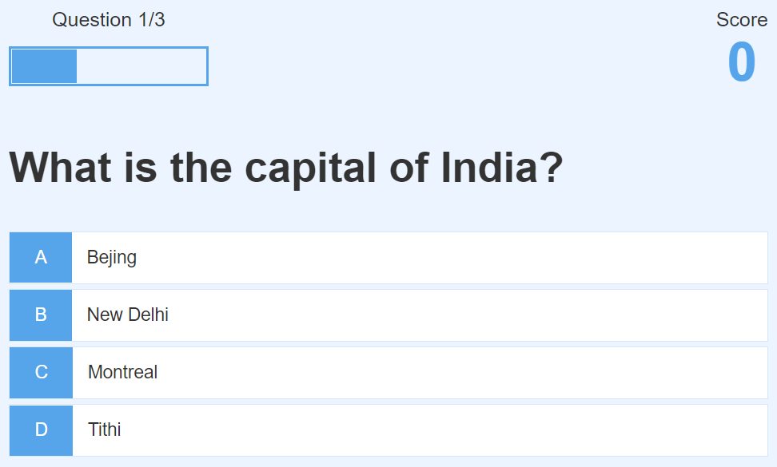

# Application Name

### App Name - Quick Quiz

* By Godfrey Owidi

## Technologies Used
* Git
* HTML
* CSS
* JavaScript

## Description
* This is a simple quiz app built using HTML, CSS and vanilla Javascript and consumes a questions api to display 5 trivia questions for the user. No library or framework used
### Setup/Installation Requirements
* Clone this project into your preferred directory using the command **$ git clone https://github.com/godfreyowidi/Quick-App-Quiz**
* Navigate into the directory, using the command **$ cd Quick-App-Quiz**
* Open the app in your favorite code editor using the command **$ code .**
* Open the app in your favorite browser by opening it on the server _port : 5500_

### Usage
* You can answer the randomly generated questions by selecting the answers from the multiple choice questions
* After every choice, you are moved to the next question.
* You also get to see your progress bar with a total score recorded after every answer.
* After you done answering the questions, you are moved and presented with total score in the end page and also provided with opportunity to start again.

## Github Pages link
### Click here for the Github Pages link.

## Known Bugs
* No known bugs

## License

## Contact Information
godfreyowiidi@gmail.com